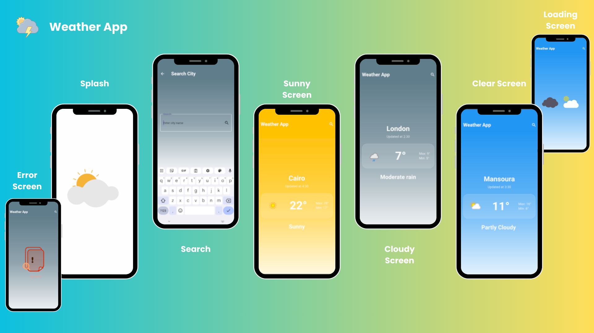

# 🌦️ Weather App



**WeatherApp** is a modern Flutter Weather Application that provides real-time weather information with a clean UI and dynamic background colors that adapt based on weather conditions.

---

## ✨ Features
- **🚀 Splash Screen on app launch**
- **👋 Welcome screen with a search icon**
- **🔍 Dedicated search screen to look up cities**
- **🌍 Displays detailed weather data for the selected city:**
    - 🌡️ Maximum temperature
    - ❄️ Minimum temperature
    - ⏱️ Last updated time
- **☁️ Weather condition (Sunny, Cloudy, Rainy, etc.)**
- **🎨 Dynamic background color that changes according to the current weather state**
- **⚡ Smooth performance and responsive UI**

---

## 🧠 Architecture
The application follows a Clean Architecture approach and uses Cubit (Bloc State Management) to ensure scalability, maintainability, and clear separation of concerns:

- **Models:** Represent weather data retrieved from the API
- **Cubit:** Manages application states (Loading, Success, Error)
- **Services:** Handles API requests and data fetching
- **Views:** Application screens (Splash, home, Search)
- **Widgets:** Reusable UI components

---

## 🔧 Technologies & Tools
- **Flutter**
- **Dart**
- **Cubit (Bloc State Management)**
- **RESTful APIs**
- **Dio Page**
- **Lottie Page**
- **Free Weather API**

---

## 🌐 API Integration

This app integrates a Free Weather API to fetch real-time weather data based on the searched city name.

---

## Project Structure

```
lib/
├── models/
│   └── weather_model.dart
├── services/
│   └── weather_service.dart
├── views/
│   ├── splash_view.dart
│   ├── home_view.dart
│   ├── search_view.dart
├── widgets/
└── main.dart
```

---

## 🚀 Getting Started ##
1- **Clone the repository**
2- **Run flutter pub get**
3- **Add your Weather API key**
4- **Run the application 🚀**

---

## 👩‍💻 Author
**Esraa Elshiekh**
**Flutter Developer**


